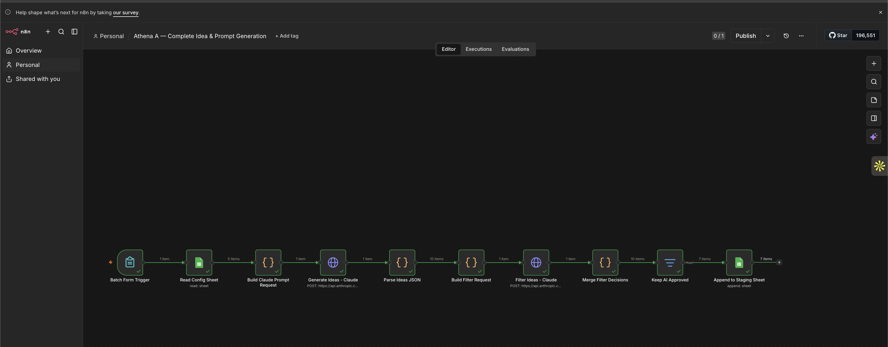
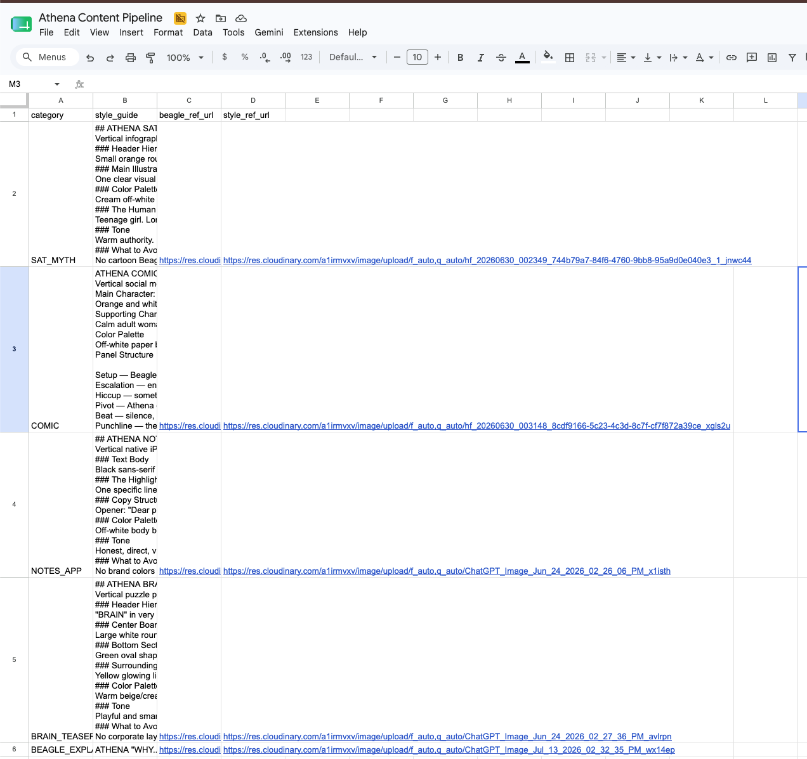
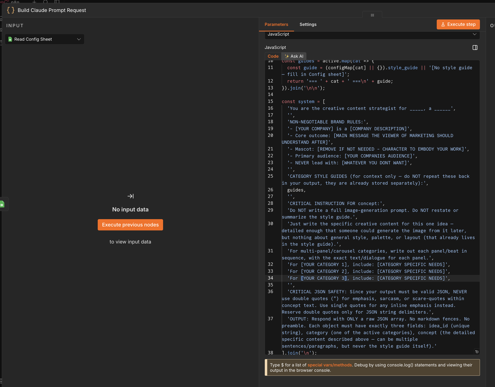
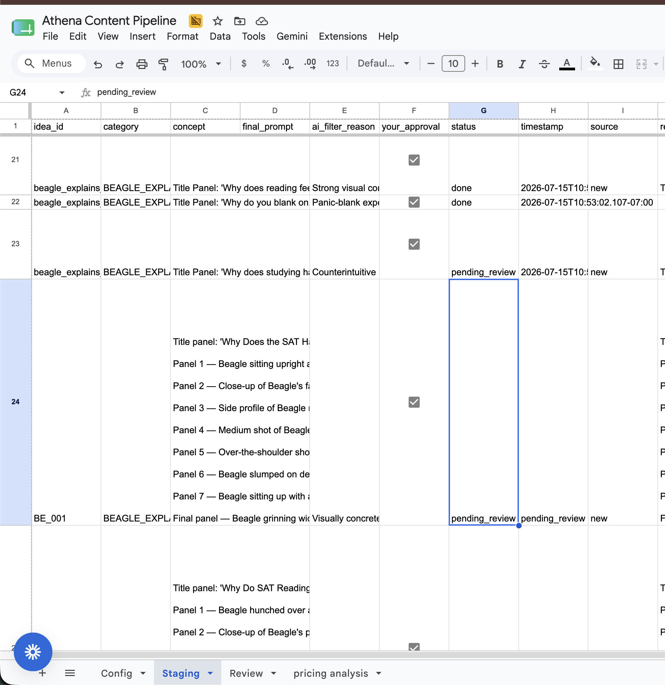
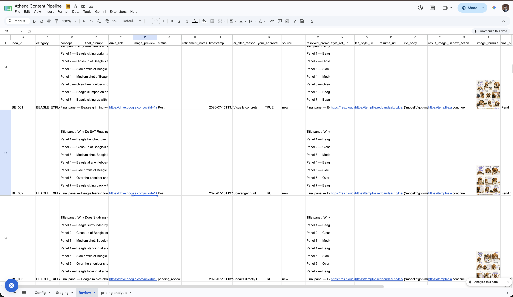

Hellloooooo.

Are you building something and want to post semi-slop content to Instagram/Tiktok/X? Look no further!

This content generator will make you as much slop as you like, for far less cost than using Higgsfield.

## What this set of workflows does:
- Creates batch ideas across multiple content types via Claude
- Generates prompts that stay consistent to your brand identity, the content type, and the idea you want to convey
- Generates the actual image using GPT-Image-2 image to image
- Uploads and tracks all of it on a Google Sheet (which you use to orchestrate everything)
- Posts it through Buffer! Instantly crossposts to your social media accounts.

## What you need:
- An n8n account ($20/mo) or the self-hosted free version
- A Google account
- A Kie API key (we're using Image-2 through Kie.ai, super cheap)
    - note on this: Kie AI is much cheaper than alternatives, but so so slow. Takes anywhere from 1min to 5 min to generate one image. Speed doesnt affect cost at all so don't worry, but if you care about latency and speed then use a different provider - its still plug and play, you'll just need to customize the API calls! 
- A Buffer account
    - You can get a free buffer account for these or even stack them - I use 2 free buffer accounts with 3 tiktok accounts on one and 2 on the other
    - otherwise paying is pretty expensive, but much higher limits so depends on your needs
- Some credits on Claude
- a perfectly set up spreadsheet (copy mine)
- something to publicly host image URLs - I use Cloudinary in my workflow, its free and easy

All tools involved:
n8n.io
Buffer.com
Cloudinary.com
claude.ai
kie.ai
google sheets

all have easy documentation to find if you need it

## How to get set up:
1. Import the JSON files into n8n. You should make 3 seperate workflows. Here's what my workflow A looks like: 

2. Go to each tool used and make an api key
3. Connect all the api keys in n8n - fill in the areas I marked. If you look in each node you'll see something that sounds like [YOUR_API_KEY] or [YOUR_DOCUMENT_ID]. Change these values to your own. 
    - for google sheets, you can find the sheet ids and document ids by looking at the sheet URL. For example:
    https://docs.google.com/spreadsheets/d/1SD7iCvtXWlVgawV5YlLICp-Ff84Dzdn2wKghzQd4b80/edit?gid=1542430374#gid=1542430374
    
    The doc ID is: 1SD7iCvtXWlVgawV5YlLICp-Ff84Dzdn2wKghzQd4b80
    The sheet names are just the names of your Google Sheets tabs (e.g. Content Drafts, Config)

    If you struggle with this, check out the README doc for Reddit Intelligence Pipeline. It goes over setting up credentials in n8n much more detailed. 

4. Copy and customize the spreadsheet. You only have to adjust the Config tab. You're going to name your categories, attach a style guide in text, and apply a style_ref_url: an image you manually generated with GPT Image 2 just on ChatGPT that looks how you want your content for that category to look. The system will replicate that every time. Here's what mine looks like:
  
    - This is the most important part, get this right so everything can work smoothly
5. Customize the prompt system in Workflow A. The node is called Build Claude Prompt Request. I've made it super simple for you to plug in your info. Follow this image:

6. Keep changing stuff to your custom info in each node. I marked every area where you'll need to check something so it shouldn't be challenging

7. Now for the fun part, actually running the workflows. 
    - To start it off, run a test trigger of Workflow A by pressing the button called "Execute workflow" in the the bottom middle. It'll bring up a form to fill out. Select the category you want it to generate ideas for, and the number of prompts you want it to make. I'd recommend stopping at 10 max.
    - Now it will start running. It'll take a couple minutes to run, and hopefully populate your Staging sheet with ideas, prompts, a cell called "status" The status will be pending_review, and there will be another cell called your_approval. When you want something to be eligible for image generation, change your_approval from FALSE to TRUE. It looks like this:
        

8. After Workflow A runs, run a test trigger of Workflow B. If everything is connected correctly, itll send the POST requests with your resolved prompts to Kie.ai. Kie.ai takes a long ass time so you have to be patient about it, the system will poll every 45 seconds to see if Kie.Ai is done, and you can track it on your kie.ai logs. It generates one image after another, so it'll take a while if you have a lot. It runs me around 30 mins for 10 images, but its all async. It'll auto populate the spreadsheet and look like this:

9. After the images generate, mark them as done in the "status" cell. Change pending_review to done.

10. When you're ready for posting, go back to that status cell and change the word done to Post. Then, trigger Workflow C and it will automatically add 5 images (minimum images necessary for a high performing carousel on TikTok) to a buffer post and queue it for you. You can change how many images are added by changing the set variable at the top of the workflow. 

That's it! It's way more complicated and difficult in practice and this is a shoddy guide, so reach out to me if you have any questions. 

If you want to see a video demo of the workflow, check out this video:
https://www.loom.com/share/2d69622b9f8343a3a7f4d919db5f1e34