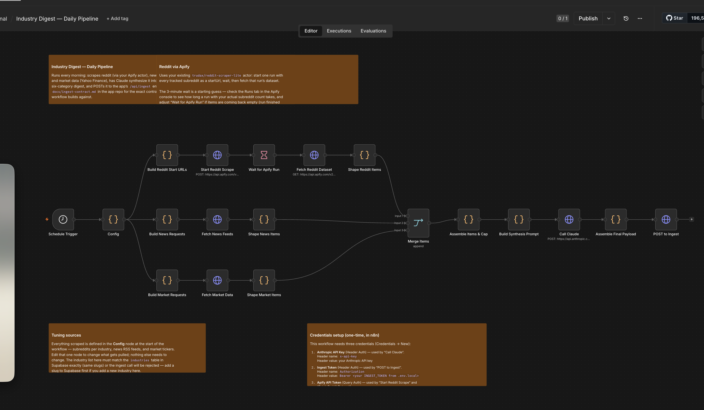

## Sentiment Digest
This is a workflow I built that aggregates data from Reddit communities, public news RSS feeds, etc. I set it up to run and upload all of this JSON data to an app I'm building out for fun:
newsdigest-fawn.vercel.app. You can do whatever you want with the workflow.
